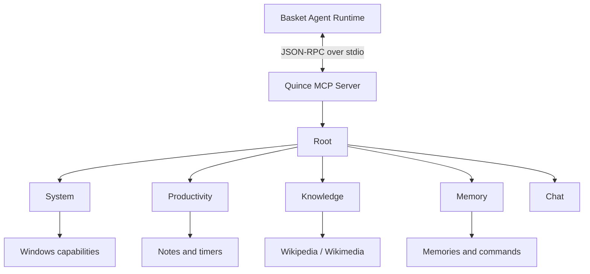

# Quince

Quince is the Windows-side runtime for a local, tool-using AI assistant. It has two closely related parts: a hierarchical MCP server that exposes Windows capabilities to Basket, and a desktop client that handles voice interaction, audio devices, hotkeys, connection management, and playback.

The MCP server comes first because it is the part that gives the agent something meaningful to do. The client is the interface around it.

## MCP Server

Quince's MCP server is built around a hierarchical tool registry rather than a flat list of every available tool.

The server exposes a root node and lets the agent move through the tree until it reaches the capability it needs.

```text
root
├── system
│   ├── clipboard
│   ├── media
│   ├── notifications
│   ├── hardware and system telemetry
│   └── power controls
├── productivity
│   ├── notes
│   └── timers
├── knowledge
│   └── wikipedia / wikimedia
├── memory
│   ├── memories
│   └── behavioral commands
└── chat
```

Basket acts as the MCP client and LLM host. Quince provides the MCP server and the capability tree.



### Why the tree exists

A conventional tool-calling implementation can expose every function to the model on every turn. That gets expensive quickly, especially with a local model. The model has to select from a large action space even when the request only concerns one small part of the system.

Quince takes a different approach. The model first chooses a domain, then navigates into that domain, sees the capabilities available there, receives the relevant schema, and executes the selected tool.

The hierarchy gives the model a smaller decision at each step without taking away its ability to perform complex tasks.

### The important part: navigation is controlled by the LLM

`reset` and `terminate` are not ordinary application functions. They are part of the MCP control flow.

The model can:

1. Navigate into a domain.
2. Execute a tool.
3. Inspect the result in its agent context.
4. Decide that another capability is needed.
5. Reset the MCP navigation state back to the root.
6. Navigate into another domain.
7. Execute another tool.
8. Repeat as many times as the task requires.
9. Call `terminate` when the requested work is complete.

This is what allows Quince to support real multi-step tool use instead of a single tool call followed by a final response.

The distinction between `reset` and `terminate` matters.

`reset` changes the MCP navigation state. It does not erase the agent's conversation context or the results that Basket has already collected.

`terminate` ends the MCP tool session. Basket uses that termination signal to break the agentic tool loop and move back to the normal response path.

### Example: search, then take notes

Consider this request:

> Search for the top locations in Mumbai and then take them down in my notes.

The agent can handle it as a sequence instead of trying to solve everything in one tool call:

```text
User request
    |
    v
Basket / LLM
    |
    | navigate(root -> knowledge -> wikipedia)
    v
Quince MCP Server
    |
    | search / retrieve information
    v
Tool result
    |
    v
Basket / LLM
    |
    | retain result in agent context
    | reset MCP navigation
    v
Quince MCP Server
    |
    | navigate(root -> productivity -> notes)
    v
Note tool
    |
    | write the locations
    v
Tool result
    |
    v
Basket / LLM
    |
    | task is complete
    | terminate
    v
Normal response
```

The useful property here is that the navigation tree does not trap the model inside one category. The model can return to the root, choose another branch, and continue using the results from earlier tool calls as part of the same agentic task.

That gives Quince a simple form of compositional tool use:

```text
one user request
        ↓
multiple tool calls
        ↓
multiple branches of the capability tree
        ↓
shared agent context
        ↓
explicit termination
```

This is the core idea behind Quince's MCP design.

## MCP control flow

The server is implemented around a small `QuinceTool` abstraction. A tool can be a category or a leaf capability. Categories contain children. Leaf tools hold their argument definitions and execution handler.

At runtime the MCP server handles three broad cases:

**Navigate to a category**

The server returns the children available in that category, together with their descriptions and argument information. Some tools can also provide prerequisite results that help the model identify the correct item to operate on.

**Execute a leaf capability**

The server validates the requested capability against the tool registry, executes its handler, and returns the result and feedback to Basket.

**Control the MCP session**

`reset` rebuilds the visible root-level navigation state. `terminate` returns a terminal result that tells Basket to end the tool loop.

The MCP server runs over stdio and is launched with:

```powershell
python run_mcp.py
```

In normal operation, Basket is responsible for connecting to and driving this MCP server as part of its agent loop.

## Capability areas

Quince currently exposes more than 40 leaf capabilities across its main domains.

| Domain | Capabilities |
| --- | --- |
| System | CPU, CPU temperature, RAM, GPU and VRAM, battery, disk, network, date/time, processes, clipboard, media controls, notifications, restart, shutdown |
| Productivity | Create, read, list, edit, append and delete notes; create, list and cancel timers |
| Knowledge | Wikipedia search, summaries and page retrieval |
| Memory | Add, read and delete memories; add, read and delete behavioral commands |
| Chat | Route general conversation directly without forcing an unrelated capability domain |

The tool descriptions are deliberately explicit. They tell the model when a tool should be used, when it should not be used, and what the arguments mean. This is especially important for system controls where a vague tool description can lead to poor decisions.

## MCP project structure

```text
quince_mcp/
├── apis/
│   ├── basket.py          # Calls back into Basket for memory and related data
│   ├── httpx_client.py    # Shared HTTP client helpers
│   └── wikimedia.py       # Wikimedia / Wikipedia access
├── schemas/
│   └── tool.py            # QuinceTool definition
├── tools/
│   ├── system/            # Windows and hardware capabilities
│   ├── productivity/       # Notes and timers
│   ├── knowledge/          # Wikipedia capabilities
│   └── memory/             # Memories and behavioral commands
├── tool_tree.py            # Root registry and hierarchy
├── server.py               # MCP server and navigation entry point
└── utils/                  # Execution and message helpers
```

The registry is kept in one place so the tree itself is easy to inspect. Adding a new capability generally means defining its handler, creating a `QuinceTool`, and placing it under the appropriate branch.

## Windows Client

The client is the other half of Quince. It turns the MCP-backed agent into something that can actually be used at a Windows desktop.

The client connects to Basket over WebSocket and handles the parts that should not be owned by the MCP server:

* push-to-talk input
* microphone capture
* PCM audio streaming
* TTS playback
* playback interruption
* connection management
* reconnect attempts
* audio-device recovery
* terminal status and logging

```text
                  User
                    |
              push-to-talk
                    |
                    v
             Quince Client
             /           \
       microphone      speaker
            |             ^
            |             |
            +--> Basket <--+
                  |
                agent
                  |
               MCP stdio
                  |
                  v
          Quince MCP Server
```

### Push-to-talk interaction

The default hotkey is `Ctrl+Q`.

Hold the key to record. Release it to stop recording and send the turn to Basket.

The same gesture also handles interruption. If Quince is speaking or still processing a previous turn, pressing and holding the hotkey interrupts the current playback and starts recording a new prompt immediately.

There is no separate interrupt command that the user has to remember.

The client keeps explicit turn state for recording, pipeline activity, playback, and interruption. Server events such as `pipeline.completed` and `cancelled` are mapped back into that local state so the UI and audio layer return to idle cleanly.

### Audio path

The microphone is captured as mono signed 16-bit PCM. The default input configuration is 16 kHz, which matches the STT path used by Basket.

The TTS playback path is kept at 24 kHz mono 16-bit PCM, matching Pocket TTS output.

The audio implementation uses Windows WASAPI where available and supports pinned input and output devices. Device selection can be matched by name and host API rather than assuming the first device returned by the system.

The client also has a device watchdog. If a configured microphone or output device disappears or is re-enumerated, the relevant stream can be reopened instead of leaving the assistant stuck on a dead audio handle.

### Connection handling

The WebSocket connection to Basket has its own connection layer with:

* connection timeout handling
* configurable ping intervals
* reconnect attempts
* exponential backoff
* clean socket shutdown
* state cleanup after unexpected disconnects

A dropped Basket connection should not require restarting Quince. The client returns to its connection loop and attempts to reconnect while keeping the hotkey and audio lifecycle under its own control.

## Client project structure

```text
src/
├── audio/
│   ├── devices.py         # Device discovery and validation
│   ├── microphone.py      # PCM16 input stream
│   ├── player.py          # PCM16 TTS playback and interruption
│   └── watchdog.py        # Device health monitoring
├── input/
│   └── hotkey.py           # Push-to-talk and interrupt gesture
├── transport/
│   ├── connection.py      # WebSocket connection and reconnect logic
│   ├── event_handler.py   # Basket event dispatch
│   └── protocol.py        # Message builders and event parsing
├── ui/
│   ├── status.py          # Terminal status line
│   └── theme.py           # Rich console styling
├── prompts/
│   └── system_prompt.py   # Default assistant prompt
├── client.py               # Quince client orchestration
├── config.py               # Environment-backed settings
├── errors.py               # Client-side exception types
└── logging_setup.py        # Logging configuration
```

The client intentionally keeps WebSocket handling, audio I/O, hotkey handling, and event parsing in separate modules. `client.py` is the coordinator rather than the place where every subsystem is implemented.

## Running Quince

Quince is currently a Windows application and is intended to run alongside Basket.

### 1. Create the environment

```powershell
python -m venv .venv
.venv\Scripts\activate
```

### 2. Install dependencies

```powershell
pip install -r requirements.txt
```

### 3. Configure the client

Copy the relevant values into `.env`. The defaults work for a local Basket instance, but audio devices are usually worth configuring explicitly on Windows.

Some of the commonly used settings are:

```env
BASKET_WS_URL=ws://127.0.0.1:7000/ws
PUSH_TO_TALK_HOTKEY=ctrl+q

AUDIO_SAMPLE_RATE=16000
AUDIO_CHANNELS=1
AUDIO_SAMPLE_WIDTH=2
AUDIO_BLOCKSIZE=640

AUDIO_INPUT_DEVICE=
AUDIO_OUTPUT_DEVICE=
AUDIO_HOST_API=Windows WASAPI

AUDIO_FALLBACK_TO_DEFAULT=false
AUDIO_WASAPI_EXCLUSIVE=false
AUDIO_WASAPI_AUTO_CONVERT=true

STT_PROMPT=Your transcription prompt
TTS_VOICE=eve
TTS_TEMPERATURE=0.75
```

The repository also supports settings for the local LLM, TTS, reconnect behaviour, logging, and device latency. The configuration module reads them from the environment and provides defaults where possible.

### 4. Start Basket

Basket must be running and listening on the WebSocket endpoint configured in `BASKET_WS_URL`.

### 5. Start Quince

```powershell
python run.py
```

A typical session is then:

```text
Quince starts
    ↓
Audio devices open
    ↓
Basket connection established
    ↓
Hold Ctrl+Q
    ↓
Speak
    ↓
Release Ctrl+Q
    ↓
Basket runs the agent and MCP loop
    ↓
Quince receives streamed TTS audio
    ↓
Playback completes
```

For direct MCP server startup:

```powershell
python run_mcp.py
```

That starts the Quince MCP server using stdio transport. In the normal Basket integration, the MCP server is consumed by Basket rather than being used directly by the human operator.

## Configuration notes

Quince uses environment-backed dataclasses for its runtime settings. This keeps device selection and connection behaviour out of the source code.

A few settings are particularly useful on Windows:

`AUDIO_INPUT_DEVICE` and `AUDIO_OUTPUT_DEVICE` can pin the microphone and speaker by name.

`AUDIO_HOST_API` can prefer Windows WASAPI over other device backends.

`AUDIO_FALLBACK_TO_DEFAULT=false` prevents a missing configured device from silently switching to another microphone or speaker.

`WS_RECONNECT=true` enables automatic reconnect behaviour.

`WS_RECONNECT_INITIAL_DELAY`, `WS_RECONNECT_MAX_DELAY`, and `WS_RECONNECT_BACKOFF` control retry timing.

## Design notes

### The MCP server is the capability layer

Quince does not try to make the MCP server responsible for conversation, model inference, or voice. Its job is narrower and more useful: expose well-defined capabilities that another agent runtime can discover and execute.

This makes the capability tree useful beyond the current voice client. Basket can reason over the same capability layer without having to know how the underlying Windows operation is implemented.

### Navigation state is separate from agent context

The current position in the MCP tree is not the same thing as the agent's conversation state.

Resetting the tree means:

```text
current MCP location -> root
```

It does not mean:

```text
conversation -> erased
agent results -> erased
previous tool calls -> forgotten
```

That separation is what makes multi-step workflows practical.

### Tool descriptions are part of the interface

Each tool has an explicit description, argument schema, required arguments, and feedback text. The descriptions are written to constrain tool choice as much as possible.

For example, the clipboard tools distinguish reading the clipboard from writing to it and clearing it. Media controls distinguish playback operations from opening or searching applications. Memory tools distinguish factual memories from behavioral commands.

The goal is not to give the model a vague collection of functions. The goal is to give it a clear action space.

### System controls are intentionally explicit

Capabilities such as restart and shutdown have narrow tool descriptions and are not hidden behind a generic system command. The model has to reach the specific capability that matches the requested action.

This is a small design decision, but it matters when an agent can operate directly on the host system.

## Dependencies

Quince is built primarily with Python and the following groups of libraries:

* `mcp` for the Model Context Protocol server
* `websockets` for the Basket connection
* `sounddevice` for Windows audio I/O
* `psutil` for system and process telemetry
* `pynvml` for NVIDIA GPU and VRAM telemetry
* `wmi` for Windows hardware information used by the CPU temperature tool
* `keyboard` for push-to-talk input
* `rich` for terminal status and logging output
* `httpx` and related clients for service calls

The exact versions are pinned in `requirements.txt`.

## Current scope

Quince is deliberately local and Windows-focused. It is not trying to be a general cross-platform desktop assistant yet.

The current architecture is aimed at three things:

1. Give Basket a reliable hierarchical capability layer.
2. Make multi-step tool use possible without exposing the entire tool tree at once.
3. Keep the user-facing voice client responsive enough for real desktop use.

The repository is being developed alongside Basket. Basket owns the conversation and agent runtime. Quince owns the Windows-facing client and the MCP capability layer.

## Related project

Quince is designed to run with **Basket**, the backend that provides the LLM orchestration, retrieval, memory, voice pipeline, and MCP client.

The two repositories are intentionally separate:

```text
Quince
    Windows client
    MCP server
    Windows capabilities
    audio and input

Basket
    conversation orchestration
    LLM / agent runtime
    retrieval and reranking
    memory
    STT / TTS pipeline
    MCP client
```

That separation lets the agent reason about capabilities without putting Windows-specific implementation details inside the backend, while the client can remain focused on the desktop interaction layer.

## Status

Quince is an active development project. The MCP capability tree, Windows client, voice interaction, reconnect handling, memory and productivity tools are working parts of the current system, while the broader agent runtime and capability set continue to evolve with Basket.

The interesting part of Quince is not any one tool. It is the mechanism that lets the model move through the capability tree, execute several tools across different branches, keep the results in the surrounding agent context, and decide when the MCP session is finished.
